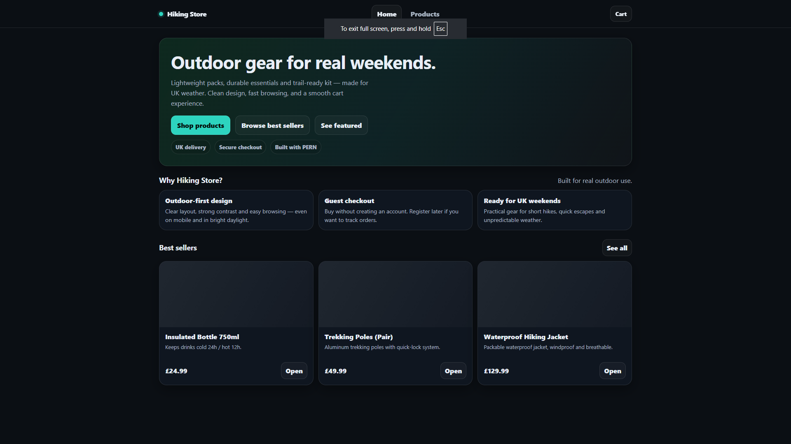
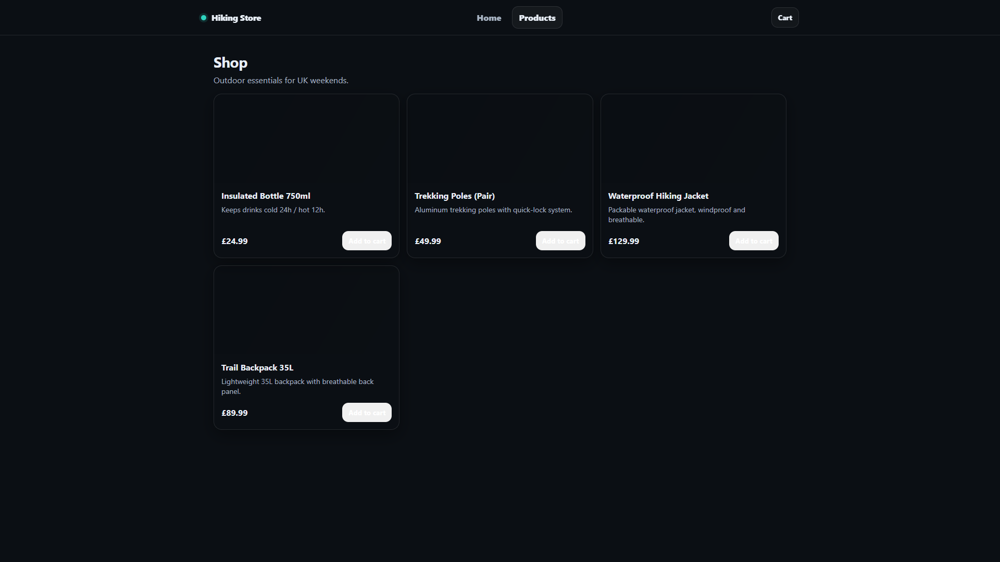
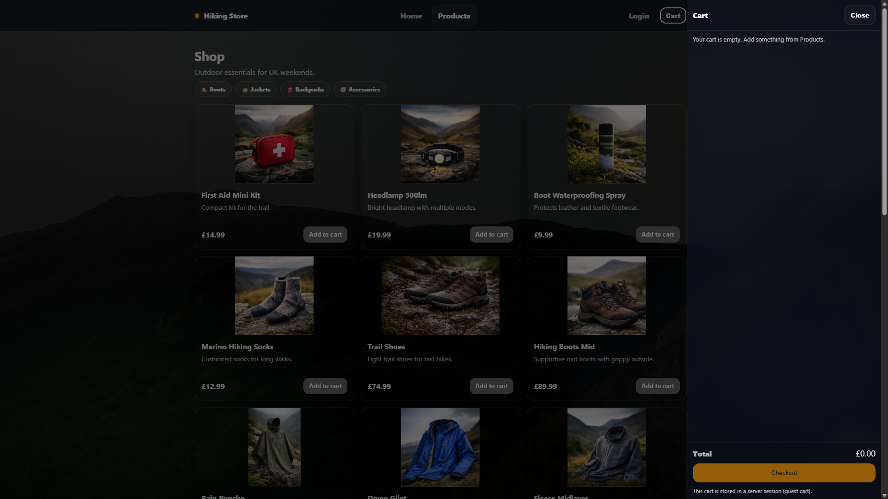
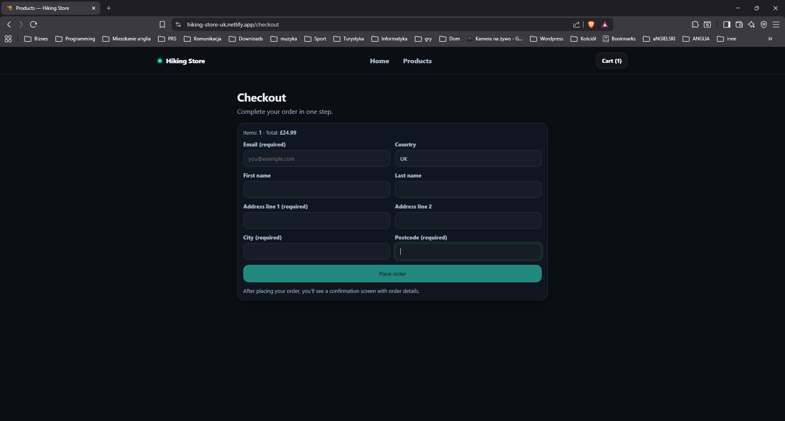
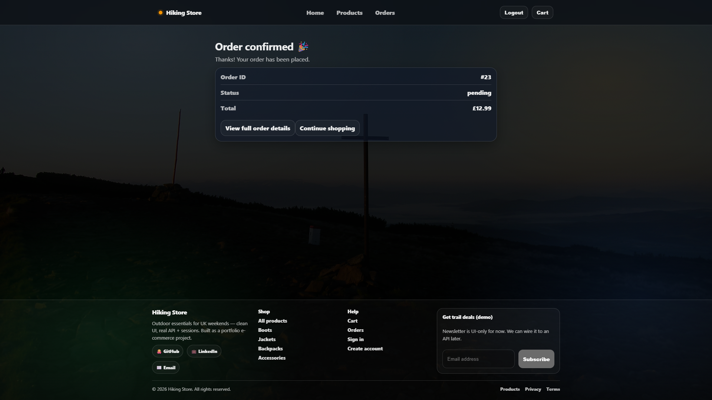

# Hiking Store — Junior Frontend Portfolio Project

A modern **e-commerce web application** built as a **portfolio project for a Junior Frontend Developer role**.

This project simulates a real-world online store and focuses on demonstrating **frontend engineering skills**, clean architecture, API integration, and UX best practices — while intentionally avoiding overengineering.

👉 Live demo:  
https://hiking-store-uk.netlify.app

---

## 🎯 Project Goals

The main goals of this project were to:

* Build a realistic React SPA with clean structure
* Integrate with a real backend API
* Handle async states, errors, and edge cases
* Demonstrate production-style UX patterns
* Show how a frontend works with sessions & server state
* Create a portfolio-ready project similar to real commercial work

---

## Tech Stack

### Frontend

* React (Vite)
* React Router (SPA navigation)
* Styled-components
* Context API (global cart & auth state)
* Fetch API
* Responsive design (mobile-first)

### Backend (integrated)

* Node.js + Express
* PostgreSQL
* Server-side sessions & cookies
* Guest + authenticated carts
* Hosted on Render

### Deployment

* Netlify — frontend
* Render — backend API
* PostgreSQL — database

---

## Key Features

### 🛒 Shopping & Cart

* Product list fetched from REST API
* Category filtering & navigation
* Add to cart / remove / quantity update
* Server-side cart stored in session
* Cart persists across page reloads
* Guest + logged-in user cart support

### ✅ Checkout Flow

* Guest checkout (no login required)
* Form validation (email, address, postcode)
* POST `/checkout` integration
* Order creation in database
* Cart is cleared after successful checkout

### 📦 Orders

* Order confirmation page with order number & total
* Orders stored in PostgreSQL
* Protected order details page (auth required)
* Friendly empty states & error handling (401, 404)

### 🔐 Authentication

* Email + password authentication
* Session-based auth
* OAuth login (Passport.js):
  * Google
  * Facebook
* Protected routes for user-specific data

### 🎨 UI & UX

* Responsive layout (mobile & desktop)
* Skeleton loaders & loading states
* Disabled buttons during requests
* Clear success & error messages
* Consistent design system with styled-components
* Category tiles & chips navigation

---

## What I Learned

During this project I practiced and improved:

* Designing a **realistic React app architecture**
* Working with a real backend API
* Managing global state with Context API
* Handling async loading & error states
* Building session-based cart logic
* Implementing protected routes
* Debugging API & auth issues
* Improving UX with skeleton loaders & feedback
* Working with cookies & CORS in production

---

## Project Scope (Intentional Decisions)

To keep the project focused on **frontend fundamentals**, the following features were intentionally **not implemented yet**:

* Payments (e.g. Stripe)
* Admin panel
* Product management UI
* Stock & inventory management
* Email notifications

These features are outside the scope of a Junior Frontend portfolio and would add unnecessary complexity.

---

## 📸 Screenshots

### Home Page


### Products Page


### Cart Drawer


### Checkout Page


### Order Confirmation Page


---

## How to Run Locally

```bash
npm install
npm run dev
